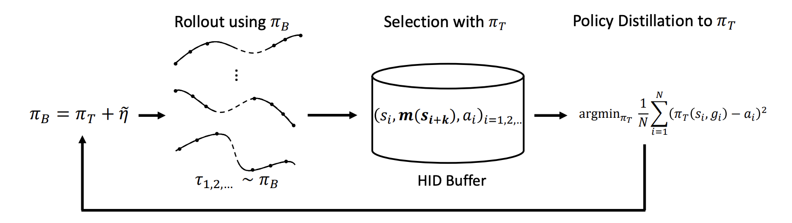

# Evolutionary Stochastic Policy Distillation



This repo provides code for the *Evolutionary Stochastic Policy Distillation* [[arXiv paper](https://arxiv.org/pdf/2004.12909.pdf)]

## TL;DR

A self imitation algorithm called ESPN is proposed to solve the goal-conditioned reward sparse tasks. ESPN learns a target policy efficiently from a series of its stochastic variants in a supervised learning manner. Experiments on the MuJuCo robotics control suite show its superior performance over baseline Hindsight Experience Replay (HER) and evolution strategies (ES).

## Quick Start

The only dependencies are pytorch, gym and mujoco. 

The paper results can be reproduced by calling the train.py directly, e.g.,

```
python train.py
```


To change the environment, users can just change the *--env-name* from one of 'FetchPush-v1','FetchSlide-v1', and 'FetchPickAndPlace-v1'.

The result of [PCHID](https://sites.google.com/view/neurips2019pchid) can be reproduced based on this codebase by progressively increase the hyper-parameter Horizon from 1 to K. As our ablation studies have shown in the paper, using Horizon = 8 can always achieve relatively high performance. Therefore PCHID can be interpreted as a special case for ESPD, and its performance should be upper bounded by ESPD.


## Reference
```
@inproceedings{sun2020espd,
  title={Evolutionary Stochastic Policy Distillation},
  author={Sun, Hao and Pan, Xinyu and Dai, Bo and Lin, Dahua and Zhou, Bolei},
  booktitle={arXiv preprint arXiv:2004.12909},
  year={2020},
}
```


## TODO: multi-proc acceleration, @pxy
